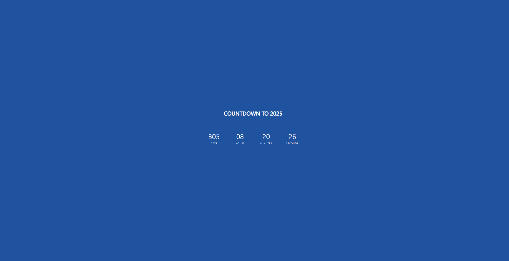

# Countdown App

Countdown app that was created with HTML/CSS and JavaScript

### View how much time we have left in this current year! [here](https://kimdaby.github.io/Countdown-App/)

## Summary

Countdown App is a web application created using HTML, CSS, and JavaScript. The app's main functionality involves counting down to the end of each year. Users interact with a user-friendly interface built with HTML and styled using CSS. JavaScript is employed to handle the countdown logic, ensuring accurate and real-time updates as the target date approaches.

## Author

David (Yun) Kim
git
